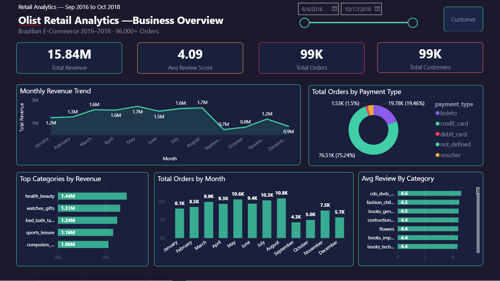
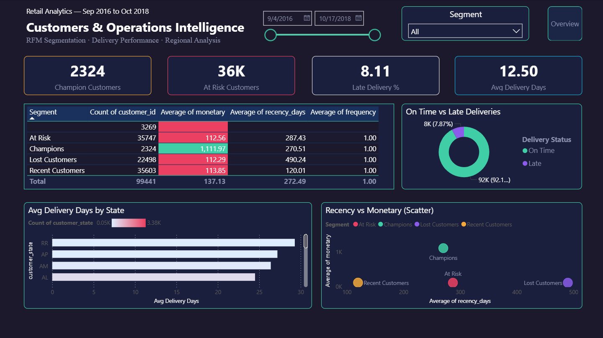

# 🛒 End-to-End Retail Analytics Pipeline


## 📌 Project Overview
An end-to-end analytics pipeline built on the Brazilian E-Commerce 
dataset (Olist) with 100,000+ orders across 2016-2018.

## 🏗️ Architecture
```
Raw CSV Data → MySQL (SQL Analysis) → Python (ML Clustering) → Power BI (Dashboard)
```

## 🛠️ Tools Used
- **MySQL Workbench** — Data storage & advanced SQL analysis
- **Python** (Pandas, Scikit-learn) — RFM Customer Segmentation using KMeans
- **Power BI** — Interactive 2-page dashboard with drill-through & bookmarks
- **Git & GitHub** — Version control

## 📊 Dashboard Preview
### Page 1 — Business Overview


### Page 2 — Customers & Operations


## 💡 Key Business Insights
1. **Health & Beauty** is the highest revenue category at R$1.26M
2. **8.1%** of deliveries arrive late — concentrated in northern states
3. **Champions segment** (only 2.4% of customers) generates 10x more 
   revenue than Lost customers
4. **Credit card** dominates at 74% of all payments
5. Revenue grew **20.4%** from 2017 to 2018

## 🗂️ Project Structure
```
📁 retail-analytics-pipeline/
├── 📁 sql/
│   ├── 01_kpi_queries.sql
│   ├── 02_advanced_queries.sql
│   └── 03_rfm_segmentation.sql
├── 📁 python/
│   └── rfm_clustering.ipynb
├── 📁 powerbi/
│   └── retail_dashboard.pbix
├── 📁 data/
│   └── data_dictionary.md
└── README.md
```

## 🚀 How to Run
1. Clone this repo
2. Import CSVs to MySQL using the Python import script
3. Run SQL files in order (01 → 02 → 03)
4. Run Python notebook to generate rfm_segmented.csv
5. Open Power BI file and refresh data source paths
